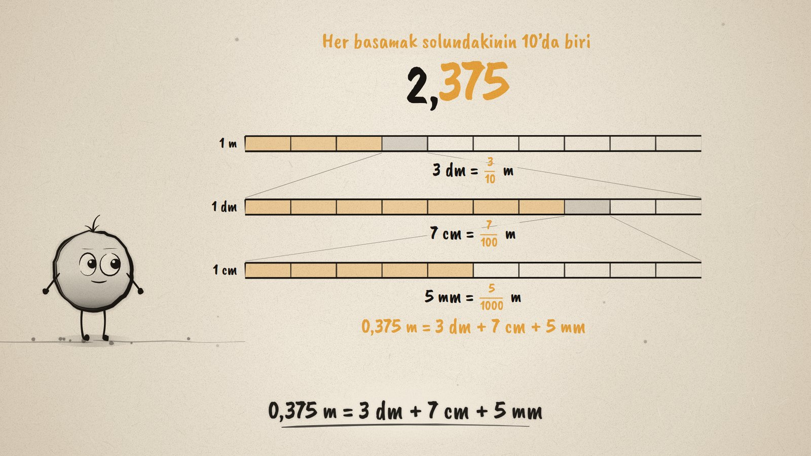
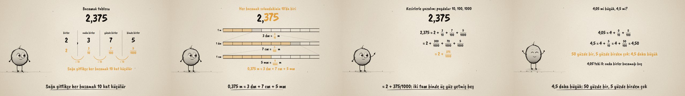

# Virgülden Sonra · Decimal Place Values

**▶ Tarayıcıda izleyin / Watch in the browser:** https://hakanatas.github.io/virgulden-sonra/ 
**⬇ MP4 + altyazılar / MP4 + subtitles:** [Releases](https://github.com/hakanatas/virgulden-sonra/releases) 
**✎ Kullanılan istem / The prompt behind it:** [PROMPT.md](PROMPT.md) 
**🎞 Bütün filmler / All films:** [Nokta'nın Filmleri](https://hakanatas.github.io/nokta-filmleri/?sinif=6)

> **TR —** 6. sınıf matematik "Sayılar ve Nicelikler" temasındaki MAT.6.1.5 öğrenme çıktısı için hazırlanmış, tamamen JavaScript ile çizilen 92 saniyelik mürekkep animasyonu. 2,375 metrelik bir kurdele: rakamlar basamak tablosuna yerleşiyor (birler, onda birler, yüzde birler, binde birler) ve her basamağın değeri kesirle yazılıyor: 3/10, 7/100, 5/1000. Sağa gittikçe her basamak 10 kat küçülüyor. Sonra bir metre üç kez büyütülüyor: 3 desimetre, 7 santimetre, 5 milimetre; yani 0,375 m = 3 dm + 7 cm + 5 mm. Sayı paydası 10, 100 ve 1000 olan kesirlerin toplamı olarak yazılıyor ve "iki tam binde üç yüz yetmiş beş" diye okunuyor. Son olarak 4,05 ile 4,5 karşılaştırılıyor: 50 yüzde bir, 5 yüzde birden çok. Altyazılar Türkçe, İngilizce ya da ikisi birlikte seçilebilir.

A 92-second ink animation for **6th-grade maths**, drawn entirely with JavaScript on an HTML5 canvas. Nokta, the ink character from [The Learning Ink](https://github.com/hakanatas/the-learning-ink), is the guide again. Fractions are drawn stacked (numerator over denominator) by a small layout helper, `expr` in `src/draw/film.js`, which mixes text and fractions on one line.

## Learning outcome

MEB, Türkiye Yüzyılı Maarif Modeli, Ortaokul Matematik, 6th grade, "Sayılar ve Nicelikler" theme:

**MAT.6.1.5. Gerçek yaşam durumlarında ondalık gösterimlerin basamak değerlerini kesirlerden yararlanarak yorumlayabilme**
- a) Ondalık gösterimlerin basamak değerlerini inceler.
- b) Ondalık gösterimlerin basamak değerlerini paydası 10, 100 ve 1000 olan kesirlerin toplamlarını kullanarak yeniden ifade eder.
- c) Ondalık gösterimlerin basamak değerlerini kendi cümleleriyle açıklar.

## Scenes

| # | Time | Scene | What happens | Outcome |
|---|---|---|---|---|
| 1 | 0–10 s | 2,375 metre | A ribbon 2.375 m long: what do the digits after the comma mean? | a |
| 2 | 10–30 s | Basamak tablosu | Ones, tenths, hundredths, thousandths; values 2, 3/10, 7/100, 5/1000; each place is the one before ÷ 10. | a, b |
| 3 | 30–52 s | Metreyi büyütelim | 1 m → 10 dm (3 shaded), 1 dm → 10 cm (7 shaded), 1 cm → 10 mm (5 shaded): 0.375 m = 3 dm + 7 cm + 5 mm. | a, c |
| 4 | 52–68 s | Kesirlerle | 2.375 = 2 + 3/10 + 7/100 + 5/1000 = 2 + 375/1000, read as "iki tam binde üç yüz yetmiş beş". | b |
| 5 | 68–80 s | 4,05 mi, 4,5 mi? | 4.05 = 4 + 0/10 + 5/100 and 4.5 = 4 + 50/100: 4.5 is bigger; the 0 marks an empty tenths place. | c |
| 6 | 80–92 s | Aklında kalsın | The places after the comma, each a tenth of the one before, and the fraction sum. | c |

## Running it

- **Preview:** double-click `index.html` (it works offline).
- **MP4:** run `npm install` once, then `npm run export -- --format=horizontal --captions=tr`.
- **Subtitles and narration:** `npm run srt` writes `out/captions_*.srt` and `narration_notes.txt`.
- **Editing:**
  - Caption text, timings and narration notes: `captions.js`
  - Everything on screen is drawn by `LI.world(t)` in `scenes/scene1.js` (the table, the three rulers, the fraction lines); the other scenes only set the camera.
  - The big number with glowing digits, fractions, rulers and Nokta's poses: `src/draw/film.js`; layout for 16:9 and 9:16: `src/draw/kd.js`

It uses the same engine as The Learning Ink: `renderFrame(t)` as a pure function of time, seeded randomness, and frame-by-frame export.

## Lisans · License

**TR —** Bu film ve kodu [Creative Commons Atıf-GayriTicari 4.0 Uluslararası (CC BY-NC 4.0)](https://creativecommons.org/licenses/by-nc/4.0/deed.tr) lisansıyla paylaşılır. Ticari olmayan her amaçla (derste, okulda, eğitim materyalinde) kopyalayabilir, paylaşabilir ve değiştirebilirsiniz; ancak **kaynak göstermek zorunludur**: eser sahibinin adı ve bu deponun bağlantısı belirtilmeden kullanılamaz. Ticari kullanım (satış, ücretli ürün ya da yayın) için izin alınmalıdır.

**EN —** This film and its code are licensed under [Creative Commons Attribution-NonCommercial 4.0 International (CC BY-NC 4.0)](https://creativecommons.org/licenses/by-nc/4.0/). You may copy, share and adapt them for non-commercial purposes, but **attribution is required**: they may not be used without crediting the author and linking to this repository. Commercial use requires permission.

Atıf örneği / Required credit: *“Virgülden Sonra”, Hakan Ataş, Nokta'nın Filmleri — https://github.com/hakanatas/virgulden-sonra — CC BY-NC 4.0*
